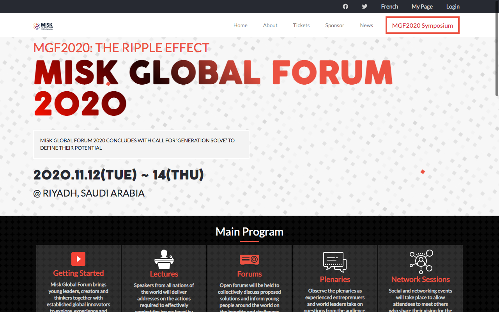

# HTML/CSS Capstone: MISK GLOBAL FORUM 2020

> This project is a website for the MISK GLOBAL FORUM that took place in Saudi Arabia from the 12th to 14th November 2020.

To cap off the HTML/CSS part of Microverse Technical Curriculum, I was given [this design](https://www.behance.net/gallery/29845175/CC-Global-Summit-2015) of [Cindy Shin](https://www.behance.net/gallery/29845175/CC-Global-Summit-2015)'s to follow, mirroring its structure, typography and colors as I built my own conference website. I opted to build a website for the just concluded Misk Global Forum 2020 which took place between the 12th and 14th of November 2020 in Riyadh, Saudi Arabia, where I was a lucky and proud attendant. The website is built mirroring the afore-mentioned features in its exact entirety. 

## Built With

- HTML, CSS
- BOOTSTRAP, SASS
- Linters Specifically Stylelint, Webhint, Lighthouse.
- VSCode on MacOS (with Prettier and Live Server extensions)
- Chrome DEV Tools

## Live Demo

[Live Demo Link](https://adoring-villani-387561.netlify.app/)

## Live Video Presentation

[Live Video Link](https://www.loom.com/share/475828aaf27047d189dbfdfb01a7526c)

### To get a local copy up and running follow these simple example steps.

- Open Terminal.

- Navigate to your desired location to download the contents of this repository.

- Copy and paste the following code into the Terminal:

- git clone https://github.com/udberg/html-css-capstone.git

- Hit enter.

- Once the repository has been cloned, open index.html in a browser of your choosing. From there, you may also navigate to the "About" and "Tickets" pages.

- Have fun!

### Linters

Install some dependencies by running the following command

npm install --save-dev stylelint@13.3.x stylelint-scss@3.17.x stylelint-config-standard@20.0.x stylelint-csstree-validator

Run the following command to check linters

npx stylelint "*/.{css,scss}"

### Deployment

Install and run a live server plugin on your Text editor.

## Author

👤 **udberg**

- GitHub: [@udberg](https://github.com/udberg)
- Twitter: [@juduak_](https://twitter.com/juduak_)
- LinkedIn: [Uduak John](https://www.linkedin.com/in/uduak-john-090059105/)

## 🤝 Contributing

Contributions, issues, and feature requests are welcome!

Feel free to check the [issues page](https://github.com/udberg/html-css-capstone/issues).

## Show your support

Leave a ⭐️ if you like this project! They're free...!

## Acknowledgments

- Hat tip to [Cindy Shin](https://www.behance.net/gallery/29845175/CC-Global-Summit-2015), for her design.
- Hat tip to [Microverse](https://www.microverse.org/) for their readme template

## 📝 License

This project is [MIT](https://opensource.org/licenses/MIT) licensed.
